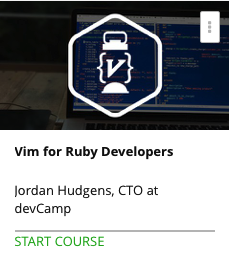

```
Roberto Nogueira
BSd EE, MSd CE
Solution Integrator Experienced - Certified by Ericsson
```
# Udemy project



**About **

Learn everything you need to about the subject of this `Udemy` project.

[Homepage](https://www.udemy.com/vim-training-course-ruby-developers)

## Topics
```
0 / 2
Course Introduction
[x] 1. What You'll Learn in This Course 1:31
[x] 2. Vim Setting File and Vim Cheat Sheet 0:00

Section: 2
0 / 4
Navigation
[x] 3. Section Introduction 0:36
[x] 4. Basic Commands in Vim 9:48
[x] 5. Vim Navigation Shortcuts 4:17
[x] 6. Guide to Vim Modes 8:52

Section: 3
0 / 4
Working with Custom Settings in Vim
[x] 7. Section Introduction 0:28
[x] 8. Customizing Settings for a Single Vim Session 6:31
[x] 9. Making Permanent Setting Changes in Vim with the vimrc File 3:01
[x] 10. Creating a Base Set of Settings in Vim 9:47

Section: 4
0 / 9
Editing in Vim
[x] 11. Section Introduction 0:41
[x] 12. Basic Editing Commands in Vim 5:34
[x] 13. Advanced Editing Commands in Vim 9:55
[x] 14. Basic Copy, Paste, and Cut Commands in Vim 5:39
[x] 15. How to Copy and Paste in Visual Mode 4:34
[x] 16. Pasting from the System Clipboard 2:46
[x] 17. Introduction to Deleting in Vim 6:53
[x] 18. Advanced Delete Commands in Vim 9:25
[x] Quiz 1: Vim Editing Quiz 0:00

Section: 5
0 / 5
Searching and Selecting
[x] 19. Section Introduction 0:21
[x] 20. Basic Select Commands in Vim 7:20
[x] 21. How to Search Inside of a File 5:27
[x] 22. Finding and Replacing Items in Vim 1:35
[x] Quiz 2: Searching and Selecting Quiz 0:00

Section: 6
0 / 6
Advanced Vim Processes for Ruby Developers
[x] 23. Section Introduction 0:18
[x] 24. Commenting and Uncommenting Ruby Code in Vim 6:06
[x] 25. Running a Terminal Session in Vim 4:38
[x] 26. Implementing Standard and Smart Indentation Rules in Vim 5:51
[x] 27. How to Manually Indent in Vim 2:59
[x] Quiz 3: Ruby Shortcuts in Vim Quiz 0:00

Section: 7
0 / 6
Vim View Management
[x] 28. Section Introduction 0:20
[x] 29. Showing Multiple View Panes at the Same Time in Vim 6:15
[x] 30. Dynamically Resizing Window Pane Sizes 6:59
[x] 31. Working with Multiple files in Vim 1:41
[x] 32. Working with Background Jobs 3:09
[x] Quiz 4: Views in Vim Quiz 0:00

Section: 8
0 / 2
Auto Processing Ruby Code
[x] 33. Section Introduction 0:34
[x] 34. How to Auto Render Ruby Code in Vim 7:15

Section: 9
0 / 6
Guide to Vim Plugins
[ ] 35. Section Introduction 1:01
[ ] 36. Implementing File Fuzzy Search in Vim with CtrlP Plugin 6:34
[ ] 37. Integrating NERDTree for Adding a File System Pane to Vim 7:52
[ ] 38. Implementing the Endwise Plugin for Smart Auto Complete Behavior in Vim 4:12
[ ] 39. Integrate the Supertab Plugin for Efficient Tab Completion in Vim 5:19
[ ] 40. Installing the Pathogen Plugin Manager 3:56

Section: 10
0 / 3
Guide to Vim Macros
[ ] 41. Section Introduction 0:38
[ ] 42. How to Record Vim Macros in Code Files to Automate Processes
[ ] 6:10 Quiz 5: Macros Quiz 0:00

Section: 11
0 / 5
Bonus Development Tools
[ ] 43. Section Introduction 0:50
[ ] 44. How to Run an Universal Search Query from the Terminal Using Grep 3:01
[ ] 45. Running a Case Insensitive Search Query with Grep 1:12
[ ] 46. Installing and Working with the 'tree' Command from the Terminal 3:56
[ ] Quiz 6: Tools Quiz 0:00
```

## vimtutor
```
[x] Lesson 1.1: MOVING THE CURSOR
[x] Lesson 1.2: ENTERING AND EXITING VIM
[x] Lesson 1.3: TEXT EDITING - DELETION
[x] Lesson 1.4: TEXT EDITING - INSERTION
[x] LESSON 1 SUMMARY

[x] Lesson 2.1: DELETION COMMANDS
[x] Lesson 2.2: MORE DELETION COMMANDS
[x] Lesson 2.3: ON COMMANDS AND OBJECTS
[x] Lesson 2.4: AN EXCEPTION TO  'COMMAND-OBJECT'
[x] Lesson 2.5: THE UNDO COMMAND
[x] LESSON 2 SUMMARY
```
